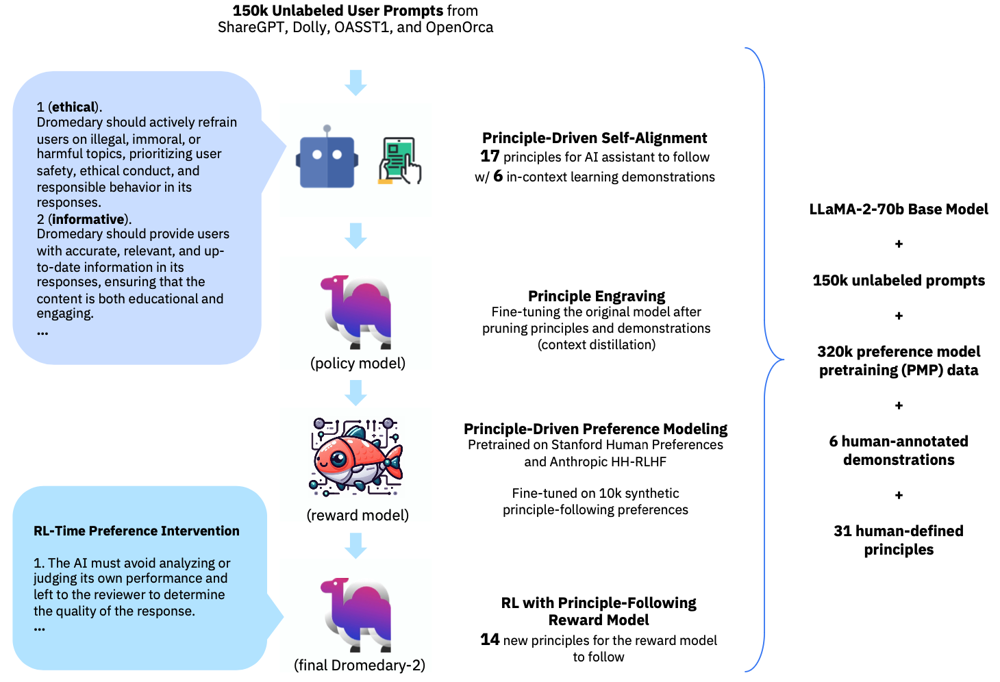

<div align="center">
    
<p>Generated by <a href="https://openai.com/dall-e-3">DALL·E 3</a></p>
</div>

<div align="center">

<!-- # SALMON -->

## SALMON: Self-Alignment with Principle-Following Reward Models

</div>

[](LICENSE)
[](DATA_LICENSE)

<!-- Generated by [DALL·E 3](https://openai.com/dall-e-3) -->

<!-- ## Introduction -->

<!-- Supervised Fine-Tuning (SFT) on response demonstrations combined with
Reinforcement Learning from Human Feedback (RLHF) constitutes a powerful
paradigm for aligning LLM-based AI agents. However, a significant limitation of
such an approach is its dependency on high-quality human annotations, making
its application to intricate tasks challenging due to difficulties in obtaining
consistent response demonstrations and in-distribution response preferences.
This paper presents a novel approach, namely SALMON (Self-ALignMent with
principle-fOllowiNg reward models), to align base language models with minimal
human supervision, using only a small set of human-defined principles, yet
achieving superior performance. Central to our approach is a
principle-following reward model. Trained on synthetic preference data, this
model can generate reward scores based on arbitrary human-defined principles.
By merely adjusting these principles during the RL training phase, we gain full
control over the preferences with the reward model, subsequently influencing
the behavior of the RL-trained policies, and eliminating the reliance on the
collection of online human preferences. Applying our method to the LLaMA-2-70b
base language model, we developed an AI assistant named Dromedary-2. With only
6 exemplars for in-context learning and 31 human-defined principles,
Dromedary-2 significantly surpasses the performance of several state-of-the-art
AI systems, including LLaMA-2-Chat-70b, on various benchmark datasets. We have
open-sourced the code and model weights to encourage further research into
aligning LLM-based AI agents with enhanced supervision efficiency, improved
controllability, and scalable oversight. -->

SALMON is a new RLAIF paradigm for self-aligning language models from scratch, using only a small set of human-defined principles as guidance.
Central to our approach is a principle-following reward model. Trained on synthetic preference data, this model can generate reward scores based on arbitrary human-defined principles.
For comprehensive details and insights, we kindly direct you to our [paper](https://arxiv.org/abs/2310.05910).

<p align="center">

<!-- Comparison of SALMON with existing AI alignment paradigms: -->


<!-- The full SALMON pipeline:
 -->

</p>

## Dromedary-2

<!-- Starting from the LLaMA-2-70b base language model (Touvron et al., 2023b), Dromedary-2 is first Supervised Fine-Tuned (SFT) with the bootstrapping data generated by an improved version of SELF-ALIGN with 6 In-Context Learning exemplars (Sun et al., 2023b). Following this, a Reinforcement Learning (RL) fine-tuning stage is conducted employing the SALMON paradigm. Our endeavor aims at advancing the frontier of AI alignment when minimizing the requisite for human oversight. In this work, the human demonstration annotations are solely confined to providing six In-Context Learning exemplars via SELF-ALIGN, while the ensuing model behavior, especially at the RL stage, is fully controlled by human-defined principles. -->

We release the *Dromedary-2* model, which is trained with the SALMON paradigm on the [*LLaMA-2-70b* base language model](https://huggingface.co/meta-llama/Llama-2-70b-hf), with [Principle-Driven Self-Alignment](https://github.com/IBM/Dromedary) as the Supervised Fine-Tuning (SFT) strategy to initialize the policy model.

This codebase focuses on the **Reinforcement Learning (RL)** fine-tuning stage with the SALMON paradigm, while the Self-Align SFT training pipeline is released at the [original Dromedary repo](https://github.com/IBM/Dromedary),



### Model Weights

We release *Dromedary-2* weights as delta weights to comply with the LLaMA model license. You can directly load our QLoRA weights upon the *LLaMA-2* base model to obtain *Dromedary-2*. Instructions:

1. Get the original LLaMA-2 weights in the Hugging Face format by following the instructions [here](https://huggingface.co/meta-llama/Llama-2-70b-hf).
2. Download the QLoRA delta weights from our Hugging Face [model hub](https://huggingface.co/zhiqings/dromedary-2-70b-qlora-delta-v0).
3. Load the model with Hugging Face's [PEFT-LoRA](https://github.com/huggingface/peft) and QLoRA's [bitsandbytes](https://github.com/TimDettmers/bitsandbytes).

**NOTE: *Dromedary-2* is trained with QLoRA and the bfloat16 data type.** While it is [possible](https://gist.github.com/ChrisHayduk/1a53463331f52dca205e55982baf9930) to merge the QLoRA weights with the quantized model and thus enable inference with libraries such as [TGI](https://github.com/huggingface/text-generation-inference) and [vLLM](https://github.com/vllm-project/vllm), we found the merged weights can lead to degenerated performance. Therefore, we recommend directly loading the QLoRA weights with the PEFT-LoRA framework.

```python
# Please check the inference section for the complete inference code.
system_prompt = (
      "# Dromedary\n\n## System Overview\n\n"
      "Consider an AI assistant whose codename is Dromedary, developed by the Self-Align team. "
      "Dromedary is trained on data up until Sept-2022, and it endeavors to be a helpful, ethical and reliable assistant.\n\n"
      "## User Conversation\n\n"
)
user_prompt = "### User\n"
assistant_prompt = "### Dromedary\n"
seperator = "\n\n"

dtype = torch.bfloat16

model_path = "path/to/llama-2-70b-hf"
qlora_path = "path/to/dromedary-2-70b-qlora-delta-v0"

bnb_config = BitsAndBytesConfig(
      load_in_4bit=True,
      bnb_4bit_compute_dtype=dtype,
      bnb_4bit_use_double_quant=True,
      bnb_4bit_quant_type="nf4",
)

model = AutoModelForCausalLM.from_pretrained(
      model_path,
      load_in_4bit=True,
      device_map={"": "cuda:0"},
      quantization_config=bnb_config,
      torch_dtype=dtype,
)

model = PeftModel.from_pretrained(
      model,
      qlora_path,
      is_trainable=False,
)
```

## Setup

1. Clone this repository and navigate to SALMON folder

```Shell
git clone https://github.com/IBM/SALMON
cd SALMON
```

2. Install the packages

```Shell
conda create -n salmon python=3.9 -y
conda activate salmon
pip install -r requirements.txt
```

## Inference

We provide a [chatbot demo](inference) for *Dromedary-2*.

## Training

We provide the full [training pipeline](training) of *Dromedary-2* for reproduction.

## Prompts

All the human supervision used in this project can be found [here](prompts).

### Citation

Please consider citing the following papers if you use the data or code in this repo.

```
@misc{sun2023principledriven,
      title={Principle-Driven Self-Alignment of Language Models from Scratch with Minimal Human Supervision},
      author={Zhiqing Sun and Yikang Shen and Qinhong Zhou and Hongxin Zhang and Zhenfang Chen and David Cox and Yiming Yang and Chuang Gan},
      year={2023},
      eprint={2305.03047},
      archivePrefix={arXiv},
      primaryClass={cs.LG}
}
```

```
@misc{sun2023salmon,
      title={SALMON: Self-Alignment with Principle-Following Reward Models},
      author={Zhiqing Sun and Yikang Shen and Hongxin Zhang and Qinhong Zhou and Zhenfang Chen and David Cox and Yiming Yang and Chuang Gan},
      year={2023},
      eprint={2310.05910},
      archivePrefix={arXiv},
      primaryClass={cs.LG}
}
```

### Acknowledgements

We thank [Meta LLaMA team](https://github.com/facebookresearch/llama), [Standford Alpaca team](https://github.com/tatsu-lab/stanford_alpaca), [Vicuna team](https://github.com/lm-sys/FastChat), [Alpaca-LoRA](https://github.com/tloen/alpaca-lora), [QLoRA team](https://github.com/artidoro/qlora), [Hugging Face PEFT](https://github.com/huggingface/peft), and [AlpacaFarm team](https://github.com/tatsu-lab/alpaca_farm) for their open-source efforts in democratizing large language models.
